# AURA — Customer Ordering System

**CSE323 · Customer Ordering subsystem** — a Flask web app where customers browse the menu, place orders, and track delivery; staff manage orders, the catalog, and fulfillment.

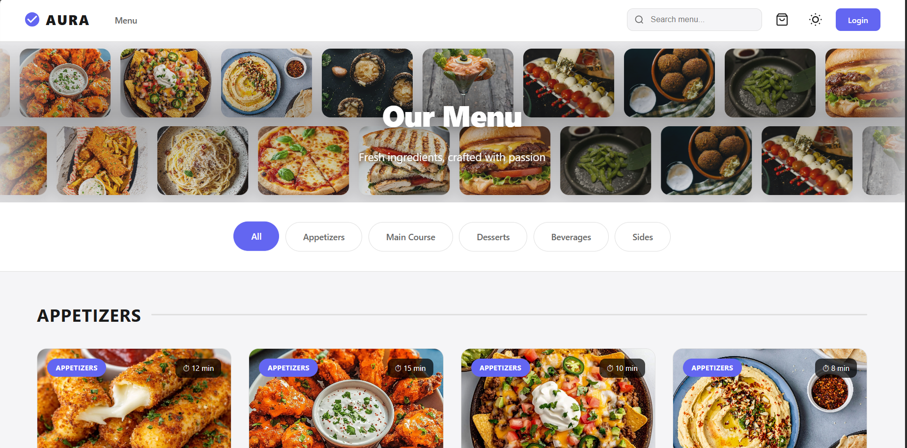

---

## Table of contents

- [Overview](#overview)
- [Screenshots](#screenshots)
- [Features](#features)
- [Tech stack](#tech-stack)
- [Architecture](#architecture)
- [Quick start](#quick-start)
- [Environment variables](#environment-variables)
- [Roles & demo accounts](#roles--demo-accounts)
- [Demo mode (order tracking)](#demo-mode-order-tracking)
- [Promo codes](#promo-codes)
- [Project structure](#project-structure)
- [API overview](#api-overview)
- [Known limitations](#known-limitations)
- [Related docs](#related-docs)
- [License](#license)

---

## Overview

AURA is a layered **Routes → Services → Repositories → Models** application:

| Role | What they do |
|------|----------------|
| **Customer** | Firebase sign-up/login, menu, cart, checkout, order history, tracking, profile & rewards |
| **Admin** | Dashboard, order status updates, menu CRUD-style management |
| **Delivery** | Pick up **READY** orders and advance to **OUT_FOR_DELIVERY** → **DELIVERED** |

Payment is recorded in the database (no live payment gateway). Card data stores **last four digits** only.

---

## Screenshots

> **First time setup:** If images do not show on GitHub, run `COPY_SCREENSHOTS.bat` once (copies PNGs from your Downloads folder into `docs/screenshots/`).

### Customer flow

| | |
|:---:|:---:|
| **Menu & categories** | **Product details** |
|  | 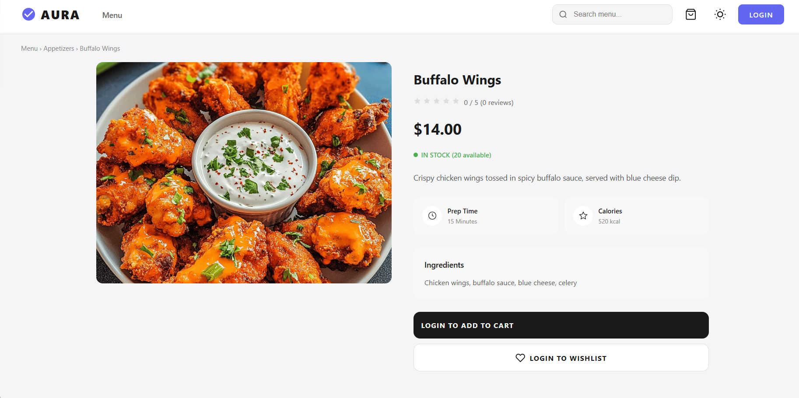 |
| **Shopping cart** (dark mode) | **Checkout** |
| 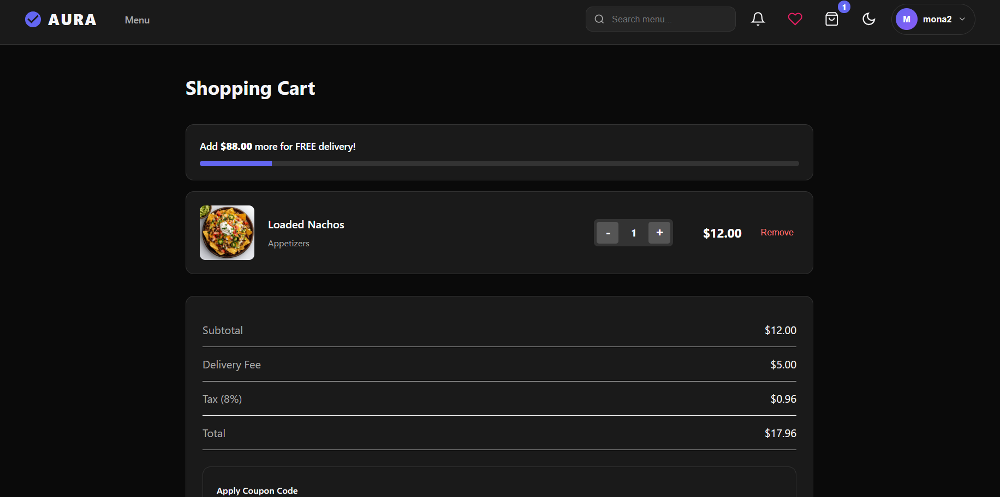 | 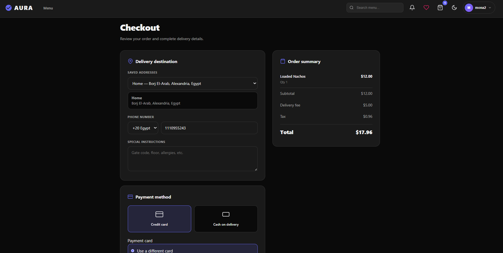 |
| **Order tracking** (live timers) | **Profile & preferences** |
| 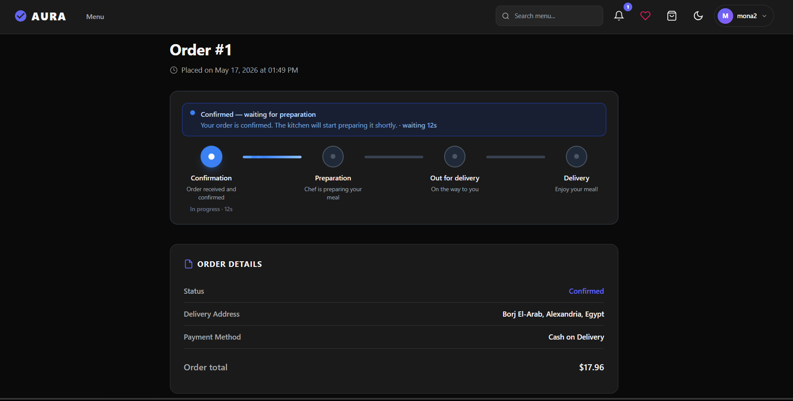 | 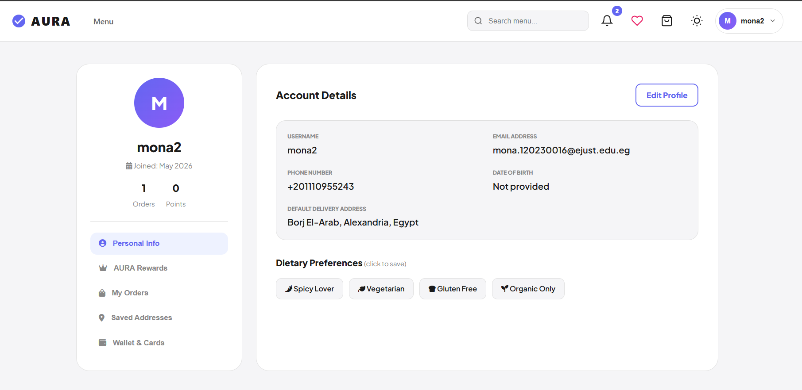 |
| **Notifications** | |
| 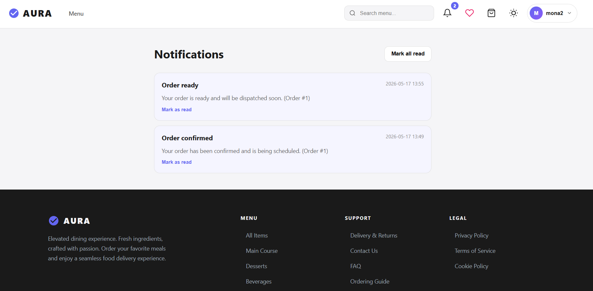 | |

### Staff

| | |
|:---:|:---:|
| **Admin dashboard** | **Admin orders** |
| 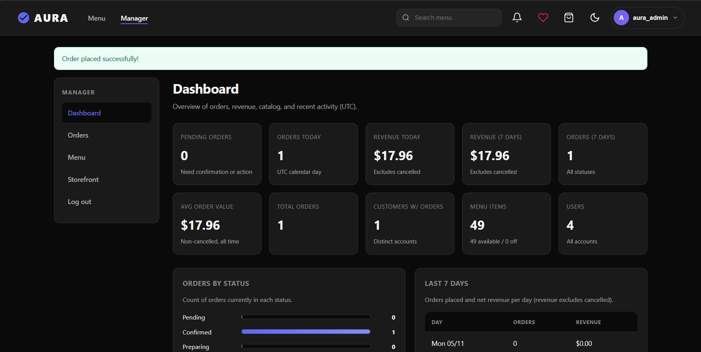 | 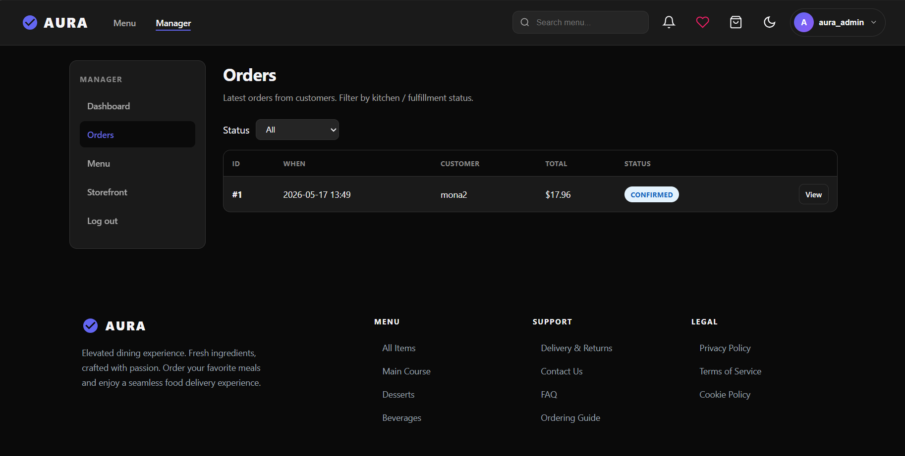 |
| **Order detail & status** | **Menu management** |
| 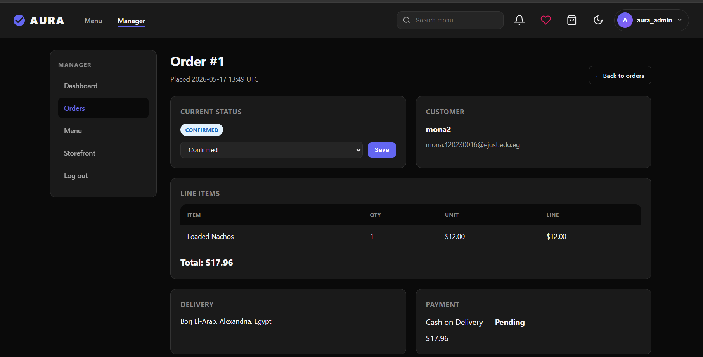 | 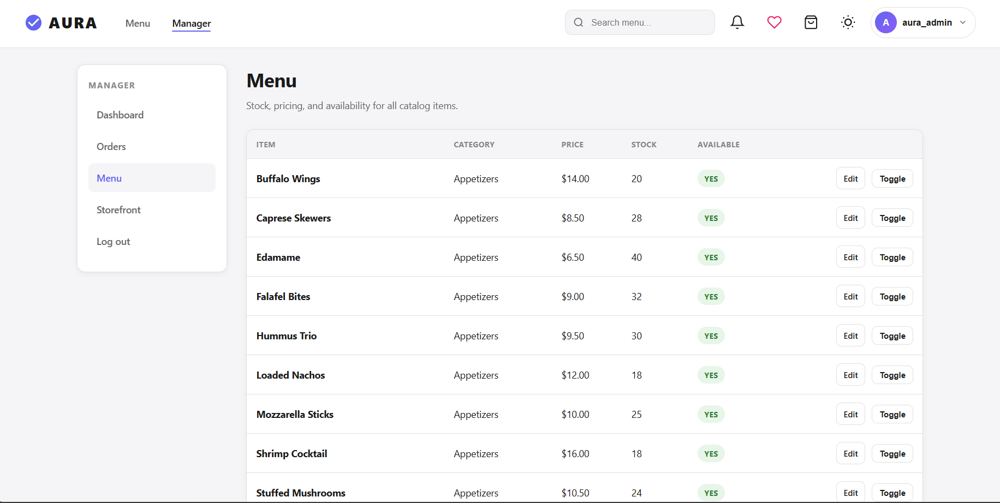 |
| **Delivery dashboard** | |
| 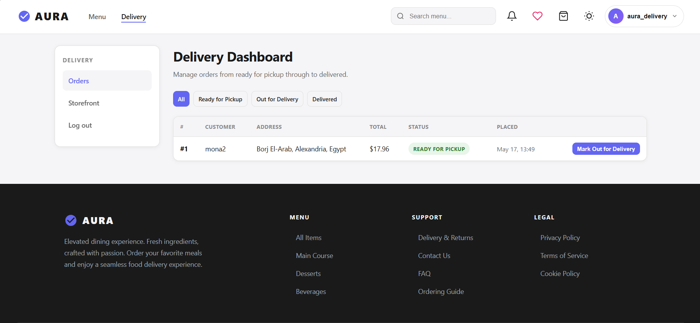 | |

---

## Features

### Customers

- Browse menu by category, search, and open product pages (reviews, wishlist when logged in)
- Session cart: add / update quantity / remove / special requests
- Checkout: saved addresses, phone, instructions, card or cash on delivery
- Pricing: promo or voucher, **$5 delivery**, **8% tax**, free-delivery progress on cart
- Order lifecycle with **4-stage tracking** and per-stage elapsed timers
- In-app **notifications** on status changes
- Profile: edit details, dietary preferences, saved cards & addresses, **AURA Rewards**

### Admin

- KPI dashboard (orders, revenue, catalog counts)
- Filter orders by status; open order detail and update status
- Edit menu items, stock, and availability toggle

### Delivery

- Filter orders: ready → out for delivery → delivered
- One-click status advance from the delivery dashboard

### Security

- Customers: **Firebase** (email verification)
- Staff: local password hash (**Werkzeug**)
- **RBAC** via `@role_required()` — `customer`, `admin`, `delivery`, `chef`

---

## Tech stack

| Layer | Technology |
|-------|------------|
| Backend | Flask 3, SQLAlchemy 2, Flask-Login, Flask-Migrate, Flask-WTF |
| Database | SQLite (`instance/app.db`) — override with `DATABASE_URL` |
| Auth | Firebase Admin + Identity Toolkit (customers) |
| Frontend | Jinja2, custom CSS (`style.css`, `admin.css`), vanilla JS |
| UI extras | Tailwind CDN on cart & order-tracking pages; light/dark theme toggle |
| Tooling | pytest, coverage (see `requirements.txt`) |

---

## Architecture

```
Routes (blueprints)  →  Services (business rules)  →  Repositories  →  Models
```

Blueprints registered in `app/__init__.py`: `auth`, `main`, `customer`, `order`, `admin`, `delivery`, `profile`, `notifications`, `pages`.

---

## Quick start

### Prerequisites

- Python **3.10+**
- pip
- Firebase project (for customer register/login) — see [SETUP.md](SETUP.md)

### Install & run

```bash
git clone <your-repo-url>
cd Customer-Ordering-System

python -m venv .venv
.venv\Scripts\activate          # Windows
# source .venv/bin/activate     # macOS / Linux

pip install -r requirements.txt
```

Create `.env` (see [Environment variables](#environment-variables)), then:

```bash
python seed.py
set SEED_DEV_STAFF=1            # Windows CMD — optional admin/delivery users
python seed.py

python run.py
```

Open **http://127.0.0.1:5000**

**Production:** `gunicorn wsgi:app`

### README images (local / GitHub)

Screenshots are stored under `docs/screenshots/`. To copy from `C:\Users\TECHNO\Downloads`:

```bash
COPY_SCREENSHOTS.bat
# or: powershell -File scripts/copy_screenshots.ps1
```

---

## Environment variables

| Variable | Required | Description |
|----------|----------|-------------|
| `SECRET_KEY` | Recommended | Flask session secret |
| `DATABASE_URL` | No | Default SQLite; use Postgres/MySQL URI in production |
| `FIREBASE_WEB_API_KEY` | For customers | Firebase Web API key |
| `FIREBASE_CREDENTIALS` | For Firebase Admin | Path to service account JSON |
| `WTF_CSRF_SECRET_KEY` | No | CSRF secret if CSRF is enabled |
| `SEED_DEV_STAFF` | No | Set to `1` when running `seed.py` to create dev staff users |

---

## Roles & demo accounts

After `SEED_DEV_STAFF=1 python seed.py`:

| Account | Password | Role |
|---------|----------|------|
| `aura_admin` | `AdminPass!123` | Admin |
| `aura_delivery` | `DeliveryPass!123` | Delivery |

Customers register through Firebase (email verification). Use your own test account for screenshots and demos.

---

## Demo mode (order tracking)

Auto-advance the timeline for presentations (mutates DB — use test orders only):

```
http://127.0.0.1:5000/order/order/<id>/track?demo=1
```

Restart from the beginning:

```
http://127.0.0.1:5000/order/order/<id>/track?demo=1&restart=1
```

| Setting | Value |
|---------|--------|
| Interval | 10 seconds per stage |
| Flow | `CONFIRMED` → `PREPARING` → `READY` → `DELIVERED` |
| Manual step | “Force next stage” in the demo panel |
| API | `POST /api/order/<id>/advance` |

---

## Promo codes

Applied at checkout (validated in `CheckoutService`):

| Code | Discount | Min. order |
|------|----------|------------|
| `SAVE10` | 10% | — |
| `AURA20` | 20% | $30 |
| `SPRING15` | 15% | $25 |

Vouchers and referral codes are also supported via the rewards system (`app/constants/rewards.py`).

---

## Project structure

```
Customer-Ordering-System/
├── app/
│   ├── __init__.py          # Application factory
│   ├── models/              # SQLAlchemy models
│   ├── repositories/        # Data access
│   ├── services/            # Business logic
│   ├── routes/              # Blueprints
│   ├── templates/           # Jinja2 HTML
│   ├── static/css/          # Global & admin styles
│   └── constants/           # Promos, rewards, roles
├── config.py
├── run.py                   # Dev server
├── wsgi.py                  # Production entry
├── seed.py
├── requirements.txt
├── SETUP.md                 # Firebase setup
├── docs/screenshots/        # README images
└── scripts/copy_screenshots.ps1
```

---

## API overview

| Area | Examples |
|------|----------|
| Auth | `POST /auth/register`, `POST /auth/login`, `GET /auth/logout` |
| Customer | `/customer/menu`, `/customer/cart`, `/customer/checkout`, `/customer/orders` |
| Order | `GET /order/order/<id>/track`, `POST /api/order/<id>/advance` |
| Admin | `/admin/`, `/admin/orders`, `/admin/menu` |
| Profile | `/profile`, `/api/addresses`, `/api/cards`, `/api/rewards/redeem` |
| Notifications | `/notifications`, `/api/notifications` |

Most JSON endpoints require login. See route modules under `app/routes/` for full detail.

---

## Known limitations

- No real payment processor (payments stay **PENDING**)
- **Chef** role exists; no dedicated kitchen display UI yet
- `product_bp` route module exists but is not registered in the factory
- End-to-end browser tests (e.g. Playwright) not included in this repo
- Demo mode changes real order rows — do not use on production data

---

## Related docs

- [SETUP.md](SETUP.md) — Firebase configuration
- [schema.sql](schema.sql) — legacy SQL reference (ORM models are authoritative)

---

## License

Educational / course project (CSE323). Add a `LICENSE` file before public distribution.

---

### Team

<!-- Add your names, IDs, and section -->

| Name | ID | Role |
|------|-----|------|
| *Your name* | *ID* | *e.g. Developer / PM* |
