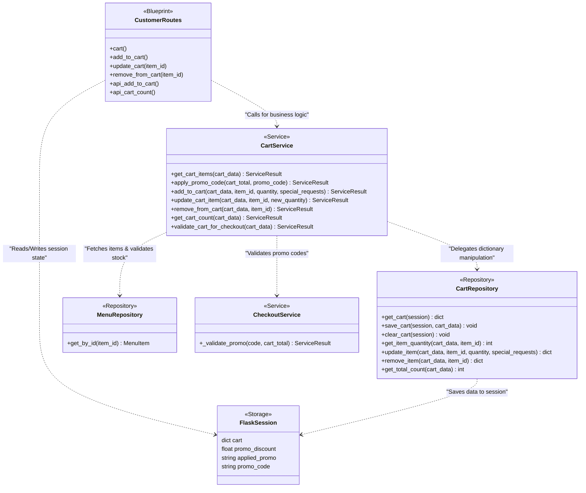

# Cart System UML Diagram

This diagram visualizes the architecture and data flow of the Cart System.

## Architecture Diagram (Class Diagram)

## Explanation of Layers

1. **`CustomerRoutes` (Presentation Layer)**: Endpoints defined in `app/routes/customer.py` intercept user actions (adding items, updating quantities, applying promos). They extract the `cart_data` from the `FlaskSession` and pass it to the `CartService`.
2. **`CartService` (Business Logic Layer)**: Contains the core cart logic inside `app/services/cart_service.py`. It handles stock validation against the `MenuRepository`, calculates totals, processes promo codes using `CheckoutService`, and delegates raw data manipulation to the repository.
3. **`CartRepository` (Data Access Layer)**: A thin abstraction in `app/repositories/cart_repository.py` to handle the pure manipulation of the cart dictionary structure without knowing about external concepts like pricing or stock.
4. **`FlaskSession` (Storage Layer)**: The cart items are currently stored persistently per-user in the Flask server-side session dictionary (`session['cart']`). It acts as transient key-value storage.
